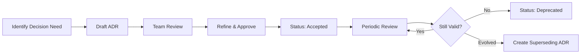

# Job Tracker Web - Documentation

This directory contains the comprehensive documentation for the Job Tracker Web application, including Architecture Decision Records (ADRs) and development guidelines.

## 📁 Documentation Structure

```
docs/
├── README.md                           # This file
├── adr/                               # Architecture Decision Records
│   ├── template.md                    # ADR template for new decisions
│   ├── 001-project-architecture.md   # High-level architecture decisions
│   ├── 002-coding-conventions.md     # Code style and formatting rules
│   ├── 003-infrastructure-conventions.md # Deployment and infrastructure
│   └── 004-technology-stack.md       # Technology choices and rationale
└── [future expansions]               # Process docs, API specs, etc.
```

## 🎯 Quick Start for Claude Code Sessions

**For immediate reference during development sessions:**
1. **Start here:** [`.claude-guidelines.md`](../.claude-guidelines.md) - Essential patterns and rules
2. **Architecture overview:** [`001-project-architecture.md`](adr/001-project-architecture.md)
3. **Code patterns:** [`002-coding-conventions.md`](adr/002-coding-conventions.md)

## 📋 Architecture Decision Records (ADRs)

ADRs document important architectural decisions made during the project. Each ADR follows a standard format and explains the context, decision, and consequences.

### Current ADRs

| ADR | Title | Status | Last Updated |
|-----|-------|--------|--------------|
| [001](adr/001-project-architecture.md) | Project Architecture | ✅ Accepted | 2025-01-24 |
| [002](adr/002-coding-conventions.md) | Coding Conventions | ✅ Accepted | 2025-01-24 |
| [003](adr/003-infrastructure-conventions.md) | Infrastructure Conventions | ✅ Accepted | 2025-01-24 |
| [004](adr/004-technology-stack.md) | Technology Stack | ✅ Accepted | 2025-01-24 |

### ADR Status Legend
- ✅ **Accepted** - Currently in use
- 🔄 **Proposed** - Under discussion
- ❌ **Deprecated** - No longer applicable
- 🔄 **Superseded** - Replaced by newer ADR

## 🏗️ Project Overview

**Job Tracker Web** is a multi-tenant SaaS platform designed for construction and field service companies to manage:

- **Jobs & Projects:** Hierarchical project management with stages and tasks
- **Worker Management:** Employee profiles, skills, licenses, and assignments
- **Time Tracking:** Clock in/out, break tracking, and approval workflows
- **Document Management:** File uploads, categorization, and sharing
- **Mobile-First Design:** Optimized for field workers on mobile devices
- **Real-time Updates:** Live collaboration and status updates

### Key Technical Characteristics

- **Multi-tenant Architecture:** Company-based data isolation using PostgreSQL RLS
- **Type-Safe Development:** End-to-end TypeScript from database to UI
- **Real-time Capabilities:** Supabase subscriptions for live updates
- **Mobile-Optimized:** Progressive Web App with offline capabilities
- **Scalable Infrastructure:** Serverless deployment on Vercel + Supabase

## 🛠️ Technology Stack Summary

| Layer | Technology | Purpose |
|-------|------------|---------|
| **Frontend** | Next.js 15 + React 19 | Full-stack framework with SSR/SSG |
| **Language** | TypeScript 5 | Type safety and developer experience |
| **Styling** | Tailwind CSS + Radix UI | Utility-first CSS with accessible components |
| **State** | Zustand + React Query | Client state + server state management |
| **Backend** | Supabase | PostgreSQL + Auth + Storage + Real-time |
| **Deployment** | Vercel | Serverless hosting with edge optimization |
| **Testing** | Jest + React Testing Library | Unit and integration testing |

## 🔧 Development Workflow

### Getting Started
1. **Read Documentation:** Start with [`.claude-guidelines.md`](../.claude-guidelines.md)
2. **Environment Setup:** Configure `.env.local` with Supabase credentials
3. **Database Setup:** Run migrations from `database-scripts/`
4. **Development:** `npm run dev` to start local server

### Making Changes
1. **Follow Patterns:** Reference ADRs for architectural guidance
2. **Type Safety:** Ensure TypeScript strict mode compliance
3. **Testing:** Write tests for new functionality
4. **Code Review:** Use `.claude-guidelines.md` as checklist

### Adding New Features
1. **Plan Architecture:** Consider creating new ADR if significant
2. **Database Changes:** Create migration scripts with RLS policies
3. **API Design:** Follow established patterns in `app/api/`
4. **Component Design:** Use existing UI components and patterns
5. **Testing:** Include unit and integration tests

## 📊 Documentation Maintenance

### When to Update Documentation

#### Create New ADR When:
- Making significant architectural changes
- Adopting new technologies or patterns
- Changing development processes
- Resolving major technical debates

#### Update Existing ADR When:
- Implementation details change
- New examples or patterns emerge
- Status changes (Proposed → Accepted → Deprecated)
- Periodic reviews reveal outdated information

#### Update Guidelines When:
- Common patterns emerge from code reviews
- Team identifies frequent mistakes or confusion
- New team members join and need orientation
- Tools or processes change

### ADR Lifecycle Management



### Review Schedule
- **Quarterly:** Review all Accepted ADRs for relevance
- **After Major Changes:** Update affected ADRs immediately  
- **New Team Member Onboarding:** Review and update guidelines
- **Post-Incident:** Update if architectural decisions contributed to issues

## 🎯 Best Practices for Documentation

### Writing ADRs
1. **Be Specific:** Include concrete examples and code snippets
2. **Explain Context:** Why was this decision needed?
3. **Document Alternatives:** What other options were considered?
4. **Show Consequences:** Both positive and negative outcomes
5. **Provide Examples:** Code examples that demonstrate the decision

### Maintaining Guidelines
1. **Keep Current:** Remove outdated patterns immediately
2. **Add Examples:** Include both good and bad examples
3. **Be Actionable:** Focus on what developers should do
4. **Reference ADRs:** Link to detailed explanations in ADRs
5. **Prioritize:** Most critical rules at the top

### Documentation Quality Checklist
- [ ] **Accurate:** Information reflects current implementation
- [ ] **Complete:** Covers all major aspects of the decision
- [ ] **Clear:** Understandable by new team members
- [ ] **Actionable:** Provides specific guidance
- [ ] **Examples:** Includes code samples and use cases

## 🔍 Finding Information

### Quick Reference Hierarchy
1. **Immediate Help:** [`.claude-guidelines.md`](../.claude-guidelines.md) - Critical patterns
2. **Detailed Patterns:** ADRs for comprehensive explanations
3. **Code Examples:** Look at existing implementations in `src/`
4. **Type Definitions:** `src/lib/types.ts` for data structures

### Common Questions & Where to Find Answers

| Question | Reference |
|----------|-----------|
| How do I structure a new component? | [ADR-002](adr/002-coding-conventions.md) + Guidelines |
| What's our database schema pattern? | [ADR-001](adr/001-project-architecture.md) + [ADR-003](adr/003-infrastructure-conventions.md) |
| How do I add a new API endpoint? | [ADR-002](adr/002-coding-conventions.md) + Guidelines |
| What technologies should I use? | [ADR-004](adr/004-technology-stack.md) |
| How do deployments work? | [ADR-003](adr/003-infrastructure-conventions.md) |
| What are the multi-tenancy rules? | Guidelines + [ADR-001](adr/001-project-architecture.md) |

## 🚨 Critical Security & Compliance

### Multi-Tenancy Security
**ALWAYS** ensure company-based data isolation:
- Include `company_id` in all table designs
- Enable Row Level Security on all tables
- Filter by `company_id` in all queries
- Test with different user contexts

### Type Safety Requirements
- No `any` types in production code
- All API responses must be typed
- Component props must have interfaces
- Database queries must be typed

### Code Quality Gates
- TypeScript strict mode (no overrides)
- ESLint passing with no warnings
- Test coverage for new features
- Code review approval required

## 📞 Getting Help

### For Development Questions
1. **Check Guidelines:** [`.claude-guidelines.md`](../.claude-guidelines.md) first
2. **Review ADRs:** For architectural context
3. **Examine Examples:** Look at similar implementations in codebase
4. **Team Discussion:** If patterns need clarification or updates

### For Documentation Issues
- **Missing Information:** Create issue or update directly
- **Unclear Patterns:** Propose ADR updates
- **New Patterns:** Draft new ADR for team review

---

## 📝 Document History

| Date | Change | Author |
|------|--------|--------|
| 2025-01-24 | Initial documentation structure created | Claude Code |
| 2025-01-24 | Added all core ADRs and guidelines | Claude Code |

---

**Next Review Date:** 2025-04-24 (Quarterly)  
**Last Updated:** 2025-01-24

> 💡 **Tip for Claude Code:** Always reference the `.claude-guidelines.md` file at the start of development sessions for the most critical patterns and recent updates.